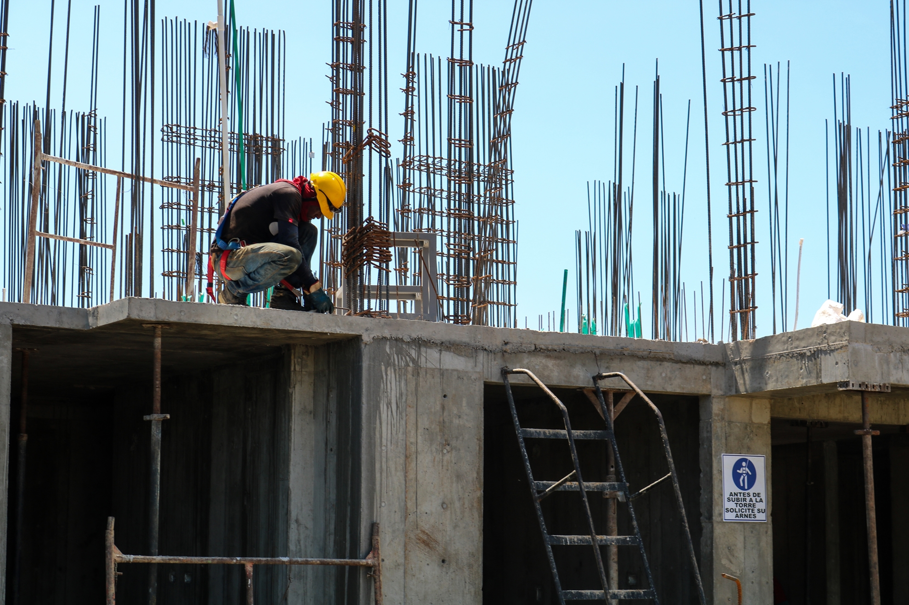

# Previsão do CUB (Custo Unitário Básico) para a Construção Civil

## 📝 Projeto

O projeto tem como objetivo analisar a série histórica dos valores do CUB e realizar previsões para os meses futuros, utilizando técnicas estatísticas com a ajuda de bibliotecas Python. Isso contribuirá para uma gestão mais precisa dos recursos financeiros em projetos de construção civil, aprimorando a viabilidade e o sucesso desses empreendimentos.

## 💻 Tecnologias

Para execução do projeto foram utilizadas as seguintes tecnologias:

- Jupyter Notebook
- Python
- Bibliotecas: 
    - Pandas
    - Seaborn
    - Matplotlib
    - Sklearn

## 📖Índice de termos

- CUB: O Custo Unitário Básico é um indicador que representa o custo médio por metro quadrado de construção de um determinado empreendimento.
- IPCA: O Índice de Preços ao Consumidor Amplo é um indicador que mensura a variação de preços de produtos e serviços consumidos pela população, e também é um dos índices utilizados no sistema de metas para a inflação.
- Padrões de construção: Podem variar, sendo _mínimo_, _baixo_, _normal_ e _alto_. Cada padrão possui seu valor de CUB específico.

## ⚙️Utilização

Para realizar uma previsão personalizada, basta atribuir o valor de IPCA, Mês e Ano desejado às variáveis _pred_ipca_, _pred_ano_ e _pred_mes_ na linha 35 do código do projeto. Através da leitura do notebook é possível compreender o uso de cada variável, bem como seus papeis na análise e previsão dos dados. Isso posto, é válido ressaltar que esse projeto está em constante desenvolvimento, e no futuro ele terá uma interface mais amigável ao usuário.

## 📩Contato

 &nbsp; [Gabriel Dornellas Falconi](https://www.linkedin.com/in/bgfalconi/)
 

 &nbsp; [bfalconi](https://github.com/bfalconi)